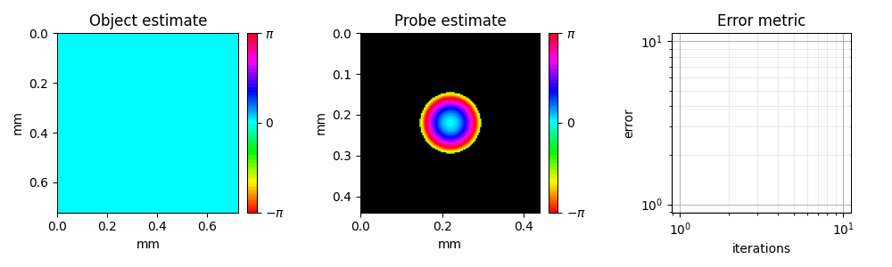

# PtyLab.py: Unified Ptychography Toolbox


[**Installation**](#installation) | [**Development and Contribution**](#development) | [**Getting Started**](#getting-started) | [**PtyLab Documentation**](https://ptylab.github.io/PtyLab.py/)

PtyLab is an inverse modeling toolbox for Conventional (CP) and Fourier (FP) ptychography in a unified framework. For more information please check the [paper](https://opg.optica.org/oe/fulltext.cfm?uri=oe-31-9-13763&id=529026).

## Key Features

- **Classic reconstruction engines**: ePIE, mPIE, mqNewton, 
- **Advanced corrections**: multi-slice, multi-wavelength (multiPIE), position correction (pcPIE), defocus correction (zPIE), angle correction (aPIE), orthogonal probe relaxation (OPR), mixed-state object and probe.
- **Multiple propagators**: Fraunhofer, Fresnel, Angular Spectrum (ASP), scaled ASP, and polychromatic variants
- **GPU acceleration**: Same code runs on CPU and GPU. 

The reconstructed output is a 6D array of shape `(nlambda, nosm, npsm, nslice, No, No)`:

| Dim | Meaning |
|-----|---------|
| `nlambda` | wavelengths |
| `nosm` | object state mixture |
| `npsm` | probe state mixture |
| `nslice` | depth slices |
| `No` | output frame size |


## Getting started

The simplest way to get started is to check the below demo in Google Colab.

[](https://colab.research.google.com/github/PtyLab/PtyLab.py/blob/main/demo.ipynb)


To explore more use cases of PtyLab, check the [example_scripts](example_scripts) and [jupyter_tutorials](jupyter_tutorials) directories. However, please install the package first as described in the below sections.

## Installation

To install the package from source within your virtual environment:

```bash
pip install git+https://github.com/PtyLab/PtyLab.py.git
```

> [!NOTE]  
> Just as a tip, to install the package very fast, we recommend using [uv](https://docs.astral.sh/uv/getting-started/installation/) and simply doing `uv pip install git+https://github.com/PtyLab/PtyLab.py.git`


This package uses `cupy` to utilize GPU for faster reconstruction. To enable GPU support:

```bash
pip install "ptylab[gpu] @ git+https://github.com/PtyLab/PtyLab.py.git"
```

To check if GPU is being used, please do `ptylab check gpu` within your environment.

### Development

Clone this repository, navigate to the root folder and install dev. dependencies with [uv](https://docs.astral.sh/uv/getting-started/installation/):

```bash
git clone git@github.com:PtyLab/PtyLab.py.git
cd PtyLab.py
uv sync --extra dev
```

This creates a `.venv` virtual environment in the project root. Select this environment from your IDE.

To use the GPU as well, install with the `gpu` flag:

```bash
uv sync --extra dev,gpu
```

and check if GPU is detected with `uv run ptylab check gpu`.

If any new changes are made, add a new test if necessary and run the full test suite.

```bash
uv run pytest tests
```

Note that CI will also do this at every PR. Please bump the package version when modifying dependencies. 

## Citation

If you use this package in your work, cite us as below. 

```tex
@article{Loetgering:23,
        author = {Lars Loetgering and Mengqi Du and Dirk Boonzajer Flaes and Tomas Aidukas and Felix Wechsler and Daniel S. Penagos Molina and Max Rose and Antonios Pelekanidis and Wilhelm Eschen and J\"{u}rgen Hess and Thomas Wilhein and Rainer Heintzmann and Jan Rothhardt and Stefan Witte},
        journal = {Opt. Express},
        number = {9},
        pages = {13763--13797},
        publisher = {Optica Publishing Group},
        title = {PtyLab.m/py/jl: a cross-platform, open-source inverse modeling toolbox for conventional and Fourier ptychography},
        volume = {31},
        month = {Apr},
        year = {2023},
        doi = {10.1364/OE.485370},
}
```

